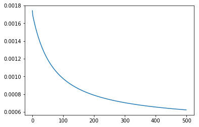

# Breast_Cancer_Using_Binary_Classification
        ->Predicting whether cancer is benign or malignant using Binary Class Classification 
        (Logistic Regression) in Python
        
        
  ### Accuracy of 94.74 %
  
  
